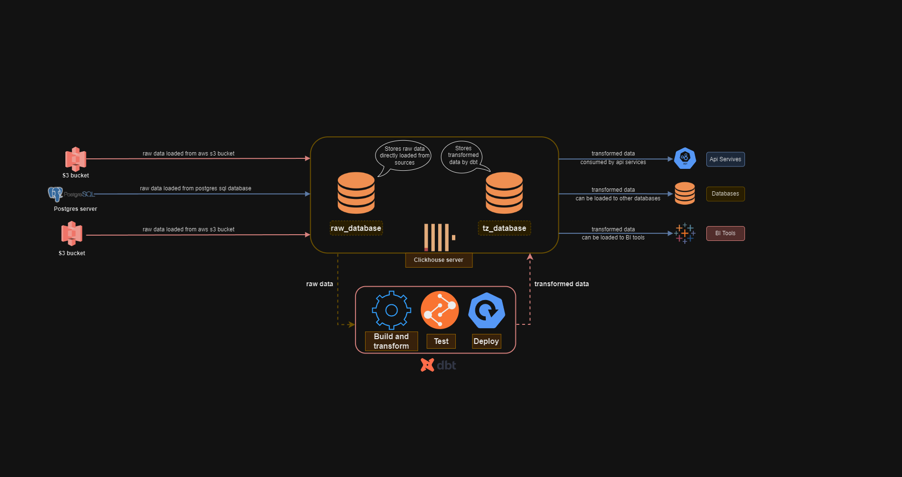
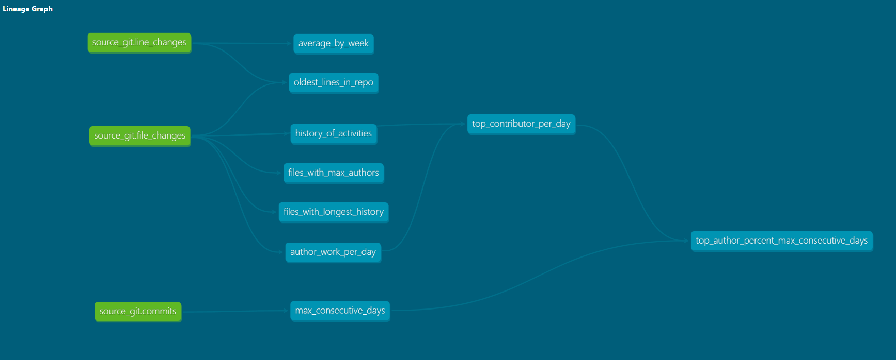

# clickhouse-dbt

Integrate dbt and clickhouse. Initializes a clickhouse server which holds two databases `raw_github_metrics` and `sz_github_metrics` which will hold raws data directly from the sources and transformed data respectively.

## Workflow diagram



## Requirements

| Name           | Version |
| -------------- | ------- |
| docker         | >= 20   |
| docker-compose | >= 2    |
| virtualenv     | >= 20   |

## Running locally.

### Run servers

- Update the credentials on .env files which includes `.env_postgres` and `.env_clickhouse`
- Create clickhouse and postgres servers

  ```
  # This will create clickhouse server and postgres server running on docker containers.

  make run-servers
  ```

- Above command will create `clickhouse` and `postgres` server along with the
  required user accounts.

- Run migrations on `clickhouse` and `postgres` respectively

  ```
  # Run clickhouse migration.

  make clickhouse-migrate

  # Run postgres migration

  make postgres-migrate
  ```

- Once migrations are created load data to postgres database,This should be done before loading data to clickhouse

  ```
  # Download the csv data file, might ask sudo password.

  make download-file

  # Load data to tables

  make load-data

  # [NOTE]: This might not work, if it doesn't work we need to manually load data to postgres table.
    In my case i had done using datagrip.
  ```

- Load data to clickhouse raw database `raw_github_metrics`
  ```
  make clickhouse-load-data
  ```
- After all these steps data will be loaded to raw database on clickhouse.
- Once all of these gets completed we can run dbt to transform data from raw database to standard database `sz_github_metrics`

### Run dbt

- Update the `profiles.yml` file in `dbt_github_metrics` dir with standard database credentials
- Setup virtual env for dbt to run, it will create a virtual env, activates it and copy the profiles.yml file to `/home/<user>/.dbt/`
  ```
  make virtualenv
  ```
- Once the virtual env is created and all the dependencies are installed, we can run dbt now

- Run dbt
  ```
  make dbt-run
  ```
- After this the data will be transformed and populated on the tables in standard database `sz_github_metrics`

- If we want documentation we can generate them by
  ```
  make dbt-generate-docs
  ```
- Once docs are generated these docs can be served on a local server
  ```
  make dbt-serve-docs
  ```
- Open `localhost:4000` and docs will be served


